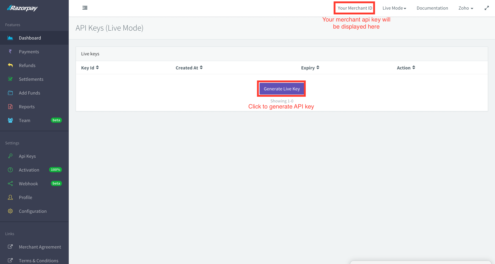

# Razorpay-React_js_integration-Node_js_Cloud_Function
Helps create a working google cloud function for server side order id generation and payment verification , and an integrated example of frontend with react js

Step 1 

Generate key and key_secret from your rayzorpay account

Step 3

Deploy cloud functions as shown in cloud functions directory readme , I used google cloud functions over Google cloud platform ,you can use other platforms like aws-lambda as well

Step 4

Integrate buttons with your react app as show in  the example react app

Step 5 

Cheers we are done !
